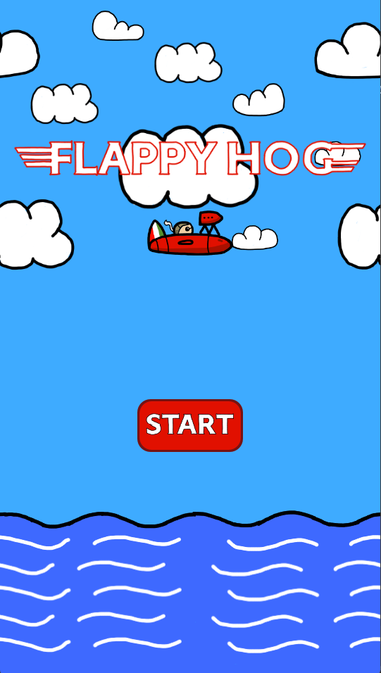
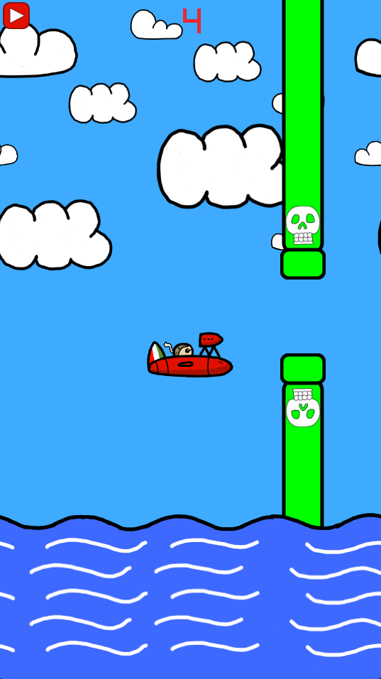

## FLAPPY HOG

### Description

Flappy Bird clone created in C++ with the use of the Raylib Library as a learning experience. 

Air Pirates are trying to stop the progress of the Flying Hog, how far can you make it? 

### Features

 - Single Player
 - Endless Runner

### Controls
Mouse: 
- Jump (Left Mouse Button)

Keyboard:
 - Jump (Space)

### Screenshots

### Developers

 - Matthew Clements - Sole Developer

### Links
Website - www.matthew-clements.co.uk

Itch.io - https://matthewclementsgames.itch.io/flappy-hog

### Extras
This game uses the Raylib library which can be found here: https://www.raylib.com/index.html

All Art Assets were created myself. 
Audio used from https://freepd.com/ and https://freesound.org/

